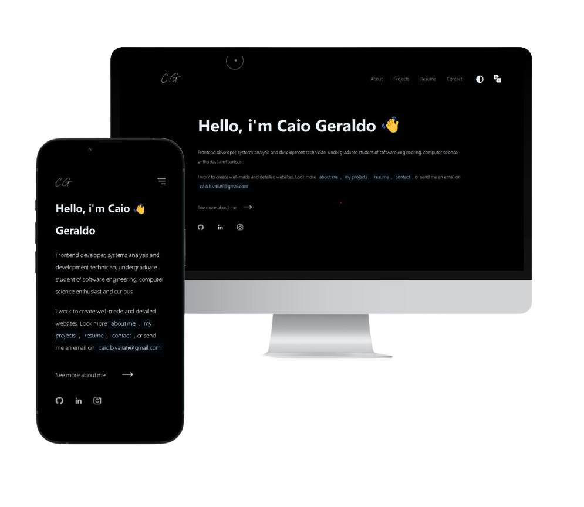

  <h1>Portfolio - v1.0   
    <a href="https://caiogeraldo.vercel.app">caiogeraldo.app</a>
  </h1>

  
  
  
  

 

UI design inspired by codewonders portfolio by @adenekan41

<h1>Presentation</h1>

My self coded portfolio <a href="https://caiogeraldo.vercel.app">caiogeraldo.app</a>, which features some of my github projects, my resume and technical skills, contact page and a beautiful home screen.

<h1>Build with</h1>

The site includes styling, responsiveness, theming, animations, and speed.      For this, I used these technologies:

<ul>
  <li>JavaScript</li>
  <li>React.js</li>
  <li>React Router</li>
  <li>Vercel</li>
  <li>VsCode</li>
  <li>Framer Motion</li>
</ul>

<h1>Features</h1>

📖 Multi-Page Layout

🨠Styled with Css

📱 Fully Responsive

<h1>Installation and setup</h1>

First, clone down this repository. You need `node.js` and `git` installed globally on your machine.

1. Installation: inside of the repo, code `npm install` or `yarn add`
2. Running the app: in the project directory, run `npm run dev`

 
<h3>If you liked it, give it a star ⭐. In any case, thank you for your attention, until next time 👋</h3>

